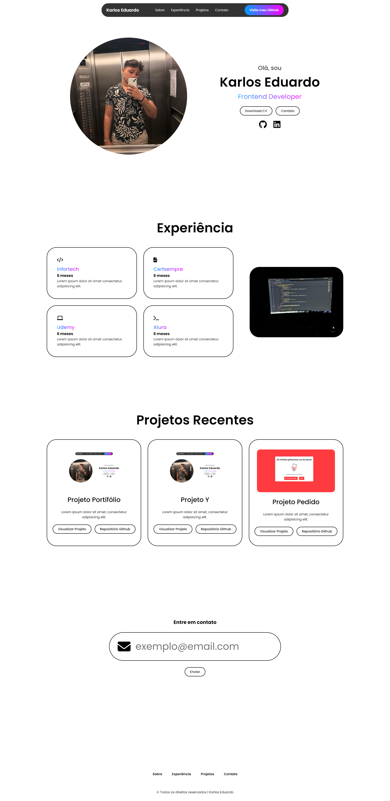

# Portfólio de Karlos

## Introdução

Bem-vindo ao meu portfólio, uma vitrine das minhas habilidades e experiências como desenvolvedor front-end. Este espaço foi cuidadosamente projetado para demonstrar minha capacidade de criar soluções digitais que não apenas atendem às necessidades dos usuários, mas também superam suas expectativas.

## Sobre Mim

Sou Karlos, um desenvolvedor front-end comprometido com a excelência em design e usabilidade. Minha abordagem se concentra na criação de experiências digitais integradas e acessíveis, utilizando as melhores práticas do setor. Com uma sólida compreensão das tecnologias web, estou sempre em busca de inovação e aperfeiçoamento, buscando novas maneiras de entregar valor através do código.

## Responsividade e Design

O design do meu portfólio foi elaborado para ser completamente responsivo, garantindo uma experiência de usuário excepcional em qualquer dispositivo, seja desktop, tablet ou smartphone. Utilizo um layout minimalista que prioriza a clareza e a navegabilidade, permitindo que os usuários se concentrem no conteúdo.

## Funcionalidades

Este portfólio exemplifica minha experiência em desenvolvimento front-end e interação com o usuário. Entre as funcionalidades destacadas estão:

- **Animações Dinâmicas**: Criação de interações suaves que aprimoram a experiência do usuário.
- **Formulário de Contato Otimizado**: Um sistema de comunicação direto e eficiente, projetado para facilitar o contato com potenciais clientes e empregadores.
- **Navegação Intuitiva**: Estrutura de navegação clara que permite um acesso rápido e fácil a todas as seções.

## Projetos Destacados

Abaixo, apresento alguns dos projetos que exemplificam meu trabalho e habilidades:

- **[Nome do Projeto 1](link-do-projeto-1)**: Uma breve descrição do projeto, destacando seus objetivos e resultados alcançados.
- **[Nome do Projeto 2](link-do-projeto-2)**: Uma breve descrição do projeto, ressaltando como ele atendeu às necessidades dos usuários e contribuiu para o sucesso do cliente.
- **[Nome do Projeto 3](link-do-projeto-3)**: Uma breve descrição do projeto e o impacto que teve na solução do problema abordado.

## Conclusão

Agradeço por visitar meu portfólio. Estou sempre aberto a novas oportunidades e colaborações que permitam explorar o potencial da tecnologia e criar soluções inovadoras. 

### Contato

**Email**: [contatokarlos12@gmail.com](mailto:contatokarlos12@gmail.com)  
**LinkedIn**: [Karlos Eduardo](https://www.linkedin.com/in/karlos-eduardo-414016253/)

Estou ansioso para discutir como posso contribuir para o seu próximo projeto!

